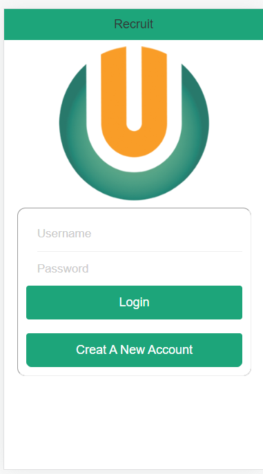
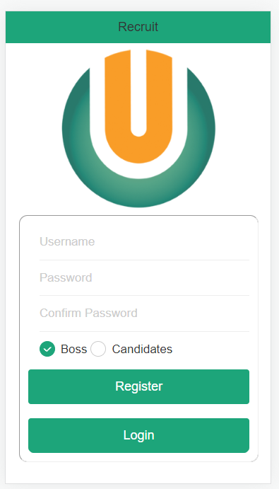
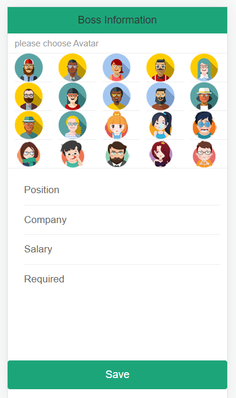
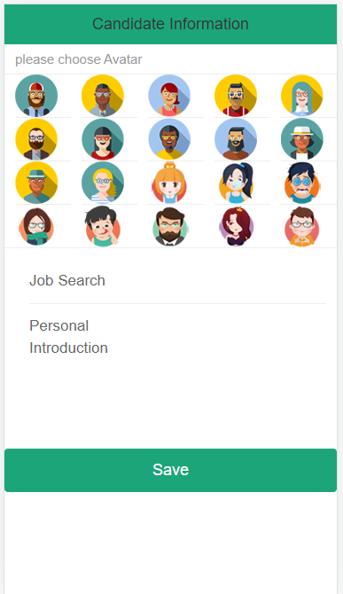
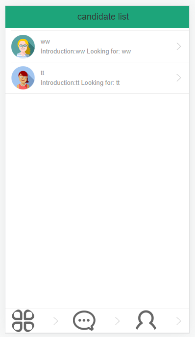
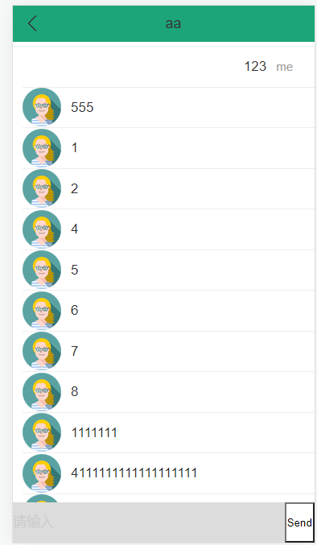
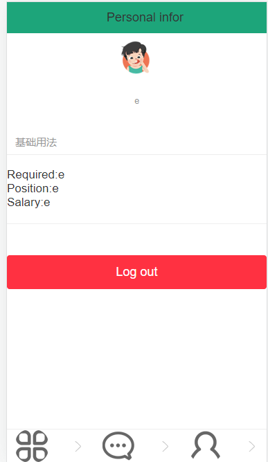
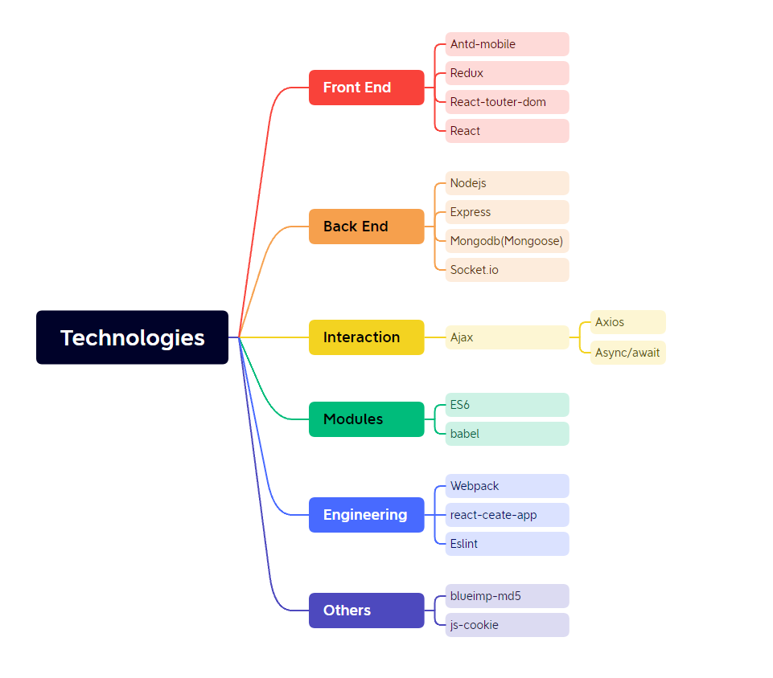
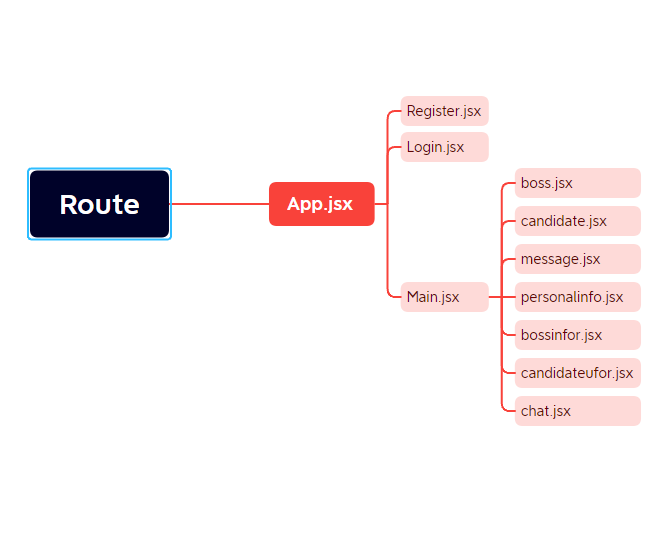

# Mobile web recruit application

##### This one is a personal practice project for me, imitating recruitment software. 

This project is a front and back office separated recruitment SPA, including front-end applications and back-end applications.

Developed in modular, component-based and engineering mode, function includes user registration/login, god/boss list, live chat and other modules.

Front-end (main technology stack): React+Redux+ES6+Webpack .

Backend (main technology stack): Node + express + mongodb + socketIO .

This project helped me a lot to understand the importance of routing for the whole SPA project, and the basic logic of front and back end  interaction. There is also componentized coding, if the componentization is very reasonable, the code reuse rate will be greatly improved.

### UI

     
    
    

     
    
    

     
    
    

     
    
    

### Guide Map

     
    

     
    

### Summary

This is an exercise program that I found on the internet by myself. I didn't finish it very well because it was a very old project, and when I got stuck, a lot of the old code in the tutorials didn't work anymore, and I tried my best to replace them all with new ones. However, it was painful for me to learn this way, and pain can be very demoralizing. So I gave up for now, the old code is useless for learning value. Nevertheless, I learned a lot about the process and thinking. The reward for the effort. Keep going.

